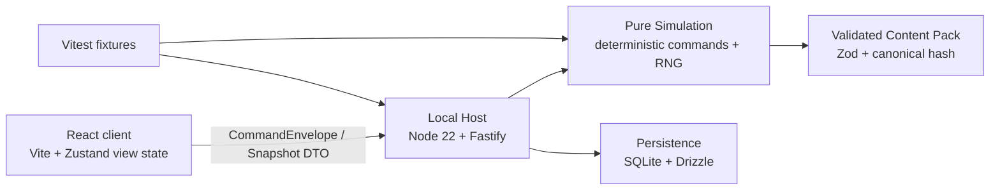

# Build 1 Architecture Decision

**Status:** Accepted Build 1 architecture decision
**Date:** 2026-07-19
**Supersedes:** the Build 1 stack/runtime portions of [Tech Decision](../product/tech-decision.md)
**Related:** [Decision Register](../product/decision-register.md), [Acceptance Plan](../product/build-1-acceptance-plan.md), [Future Compatibility Ledger](../product/future-compatibility-ledger.md), [Content Data Contract](../systems/content-data-contract.md), [Combat Simulation Contract](../systems/combat-simulation-contract.md)

## Decision summary

Build 1 will be an offline-capable local web application using a command-driven TypeScript monorepo. A React client renders immutable snapshots and sends revisioned commands to a local Node host over loopback. The host owns persistence and delegates every game outcome to a pure deterministic simulation. Content is validated data, not executable UI behavior.

This preserves the existing friends-hosted/N100 direction without implementing co-op, while adopting a strict asynchronous host protocol, snapshot-first persistence, content hashing, and fixture-driven testing.



`Fastify` provides only a local Build 1 transport. It does not expose co-op, accounts, WebSockets, cloud sync, or public APIs. A future authoritative network host implements the same host protocol; it does not replace the simulation.

## Why this architecture

| Requirement | Architectural response |
|---|---|
| UI cannot own game truth | Client consumes snapshots and submits commands only. |
| Determinism, replay, and named RNG streams | `sim` is synchronous, pure, and free of clock/network/browser dependencies. |
| Offline save/resume at every boundary | Local host commits versioned snapshot + accepted command result in one SQLite transaction. |
| Future co-op without a rules rewrite | Client uses one async host protocol now; future transport changes occur outside `sim`. |
| Data-driven cards/items/events | Content package validates definitions, gates Build 1 scope, and pins a content hash to saves. |
| Screen-heavy game UI | React/DOM/SVG is the primary presentation layer; canvas is optional later polish. |
| Fast balance iteration | Change validated content data, replay deterministic fixtures, record the content version and rationale. |

## Fixed technology choices

| Area | Choice | Reason |
|---|---|---|
| Runtime | Node 22 LTS | One stable host/runtime choice; no Node/Bun ambiguity. |
| Workspace | `pnpm` TypeScript strict monorepo | Shared types, deterministic simulation, and isolated test packages. |
| Client | Vite + React 19 + Zustand | Matches the screen-heavy interaction contract. Zustand holds snapshots and ephemeral view state only. |
| Local transport | Fastify over loopback HTTP | Thin, debuggable local boundary; no WebSocket implementation in Build 1. |
| Simulation | Pure TypeScript with zero runtime dependencies | Rules remain deterministic and independently testable. |
| Content | Authored TypeScript data compiled/validated by Zod | Strong authoring ergonomics plus runtime validation and scope gating. |
| Persistence | SQLite + Drizzle | Durable local single-file saves and explicit migrations; no cloud requirement. |
| Tests | Vitest + deterministic fixtures | Direct coverage of `SIM-*`; no browser-driven combat correctness tests. |
| RNG | Mulberry32-family streams derived from one root seed | Compatible with the archived kernel and named-stream contract. |

## Package and dependency boundaries

```text
packages/
  contracts/      command, snapshot, fact, reason-code, and protocol DTOs
  content/        schemas, definitions, validator, canonical serializer, pack hash
  sim/            pure rules, state machines, effects, RNG, fact emission
  persistence/    save envelopes, migrations, SQLite repositories, test store
  host/           session orchestration, idempotence, autosave, diagnostics
  client/         React application and snapshot-derived view models
  fixtures/       scenario builders, golden snapshots, replay assertions
apps/
  local-host/     Node/Fastify process serving the local host protocol
```

Allowed dependency direction:

```text
contracts  <- content
contracts  <- sim <- content
contracts  <- persistence
contracts  <- host <- sim, content, persistence
contracts  <- client
fixtures   -> host, sim, content, persistence
local-host -> host
```

- `contracts` contains plain serializable DTOs only.
- `sim` has no imports from React, DOM, Fastify, SQLite, filesystem, clocks, browser globals, or random globals.
- `client` never imports simulation mutators, RNG, persistence, or host implementation internals.
- `host` is the only runtime layer allowed to call simulation command application and persistence commits.
- CI must reject dependency-direction violations and `Math.random`, `Date`, `fetch`, `window`, or `document` imports in `sim`.

## Host protocol and command lifecycle

The client depends on this asynchronous protocol, not on a server implementation:

```text
GameHost
  getSnapshot(): Promise<Snapshot>
  submit(command: CommandEnvelope): Promise<CommandResult>
  subscribe(listener: SnapshotListener): Unsubscribe
```

Every game-changing action uses the existing envelope:

```text
{ commandId, expectedRevision, type, actorId?, payload }
```

The host resolves an accepted command in this order:

1. Load the authoritative session revision.
2. Return the stored original result if `commandId` was already accepted.
3. Reject stale/invalid input with a stable reason code and no mutation.
4. Call pure `sim.applyCommand(snapshot, command, validatedPack)`.
5. In one transaction, persist the new snapshot, stream states, accepted command result/facts, and any run diagnostic updates required by that boundary.
6. Publish the new immutable snapshot to subscribers.

The accepted command record stores the full result/facts needed to return the original response after reload, in addition to `resolvedEventHash`. A hash alone is insufficient for durable idempotence.

## Simulation, content, and determinism

`sim.applyCommand` is synchronous and accepts only plain serializable inputs:

```text
applyCommand(snapshot, command, validatedPack)
  -> Accepted { snapshot, facts, result, revision }
  | Rejected { reasonCode }
```

- Root seed derivation creates isolated named streams: `map`, `encounter`, `combatInitiative`, `combatIntent`, `combatTarget`, `combatDeck`, `loot`, `craft`, `event`, and `injury`.
- Each stream persists its raw state in a save. Gameplay code never calls `Math.random()`.
- Simulation state uses arrays and explicit stable-ID sorts where order matters; it does not rely on unordered object iteration.
- Content is compiled to canonical JSON, validated, frozen for the session, and identified by `contentVersion` plus `contentHash`.
- Procedural item generation creates a frozen instance/mechanic snapshot once; display/lore may change only outside its resolved mechanics.
- Every tunable Build 1 number, including class base attributes and initiative variance, belongs in the validated content/tuning pack rather than in simulation code.

## Persistence model

SQLite persists durable envelopes, not a normalized relational copy of every in-combat card and condition. The versioned JSON snapshot is the authoritative game state; Drizzle manages the small persistence schema and migrations around it.

| Record | Purpose |
|---|---|
| `campaign_save` | Current Campaign World + Haven state and save metadata. |
| `active_run` | Nullable active expedition/combat snapshot with schema/content versions and stream states. |
| `accepted_command` | Sequence, command ID, revisions, resolved facts/result, event hash, and diagnostic metadata. |
| `run_record` | Completed/wiped run facts used by the local tuning gate. |
| `chronicle_cache` | Optional cached presentation generated only from deterministic Chronicle facts. |
| `migration_record` | Explicit applied schema migrations. |

An active save includes `schemaVersion`, `contentVersion`, `contentHash`, root seed, named stream states, revision, campaign/Haven references, route state, holdings, hero snapshots, optional combat snapshot, and accepted command log reference.

Resume restores the latest valid snapshot. The command log supports diagnostics, idempotence, and replay verification; Build 1 is **not** a pure event-sourced system. An unmigratable save is preserved and reported rather than overwritten.

## Testing and operational guardrails

- Every `SIM-*` scenario runs directly against `sim` or `host` through Vitest fixtures.
- Fixtures contain snapshots, validated content version/hash, stream states or test-only forced stream draws, revisioned commands, expected facts, and state invariants.
- Test-only forced streams can control a semantic roll while still running normal simulation selection/generation code. They are non-serializable and cannot appear in production saves.
- A reusable harness proves replay equivalence, resume-at-every-boundary, idempotence, and exclusive item ownership.
- Recorded snapshots render client screens for visual/UI review, but combat correctness never relies on browser automation.
- The local diagnostic record satisfies the 20-run tuning gate without analytics network requests.

## Future co-op seam

Build 1 does not implement co-op. Later work may add a remote `GameHost` transport with identity, sessions, ownership, and WebSocket updates. It must retain the same command envelope, snapshot DTOs, simulation package, content validation, RNG ownership, and idempotence rules.

No lobby, account, Need/Greed, or WebSocket code belongs in the Build 1 executable path.

## Resolved pre-scaffold corrections

The multi-review identified six product/specification gaps. Each is now resolved in its owning specification and is a Build 1 implementation requirement.

| ID | Locked resolution | Owner |
|---|---|---|
| `SPEC-01` | `return_roadwardens` is the named Return Combat; `returning_echo` is the named Return Event. Both are loadable registry content with exact rewards/outcomes. | [Content Registry](../content/vertical-slice-content-registry.md) |
| `SPEC-02` | A successor Haven has 3 lit and 7 snuffed pillars, Haven Gloom 7, and next-run Gloom 28. | [Failure, Pillars, and Haven Succession](../loops/failure-and-torches.md) |
| `SPEC-03` | Rest has base `-12` Run Gloom. A disclosed expedition flag may modify its effective value, which UI shows before choice. | [Gloom, Light, and Rest](../systems/gloom-and-stress.md) |
| `SPEC-04` | Accepted command records persist the original result and resolved facts alongside `resolvedEventHash`. | [Combat Simulation Contract](../systems/combat-simulation-contract.md) |
| `SPEC-05` | Gloom Block is a special initial layer that expires at the owner's second turn. | [Gloom, Light, and Rest](../systems/gloom-and-stress.md) |
| `SPEC-06` | Class profiles, initiative variance, recovery, and Gloom Block values are stable tuning definitions in the accepted content/tuning pack. | [Vertical-Slice Tuning](../content/expeditions/vertical-slice-tuning.md) |

## Non-goals

- A browser-only persistence implementation, Web Worker host, WebSocket host, or cloud backend in Build 1.
- Co-op, accounts, lobby, ownership UI, Need/Greed, or public deployment.
- Game-engine shells, rollback networking, full event sourcing, or UI-owned gameplay state.
- A general inventory grid, full armor catalog, additional regions/classes, live AI mechanics, or any deferred feature.

## Consequences

- Developers run a local host and client during Build 1; an internet connection is never required for play or saves.
- The host/persistence setup has more ceremony than an IndexedDB-only prototype, in exchange for durable local saves and direct alignment with the later friends-hosted model.
- Future co-op becomes a transport/session/ownership project rather than a simulation rewrite.
- Content and persistence versioning are first-class engineering responsibilities from the initial scaffold.
