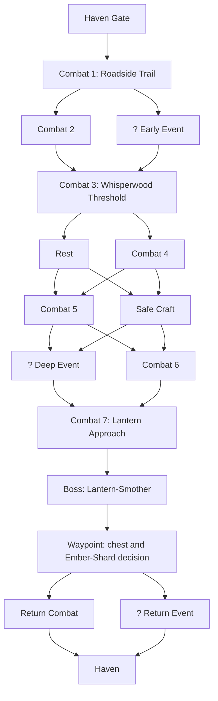

# The Unlit Road

**Status:** Accepted vertical-slice expedition map  
**Last updated:** 2026-07-18  
**Band / region:** `band_1` — Unlit Road Approach into Whisperwood  
**Boss:** [Lantern-Smother](../bosses/lantern-smother.md)  
**Related:** [Band-1 enemy roster](../enemies/band-1-frontier.md), [Map and Nodes](../../systems/map-and-nodes.md), [Vertical-Slice Handoff](../../product/vertical-slice-handoff.md)

## Player promise

The party leaves the Haven along the Unlit Road, crosses its last failing lights, and enters Whisperwood to reclaim a fallen Way-lantern. The boss must feel earned: the player makes several tactical and route choices before confronting it, but can choose how much extra combat and loot risk to accept.

This is not a tutorial. Its first encounters are deliberately readable so players learn through the ordinary play loop.

## Map topology

Combat and Rest nodes are visible on the map. Event nodes display as `?`; their fiction, outcome, and reward remain under fog of war. The Safe Craft node is visibly a ruined forge-workshop. All edges shown below are valid; the generator chooses content from the listed slot pools using the expedition seed.

## Combat cadence

| Route measure | Contract |
|---|---|
| Guaranteed before boss | Combat 1, Combat 3, Combat 7 — three standard combats |
| Typical route | Four to five standard combats before the boss |
| Combat-forward route | Six to seven standard combats before the boss |
| Rest access | One visible optional Rest after the threshold; a second may be selected later instead of further risk |
| Craft tradeoff | Safe Craft replaces an immediate standard-combat reward, not a free extra power node |
| Return | Exactly one final choice, keeping the successful boss run tense but not exhausting |

The target is a 25–45 minute full expedition. A cautious route reaches the boss with fewer rewards; a combat-forward route carries more gear, scroll, material, and marked-carrier opportunities at greater HP, resource, and Gloom pressure.

## Encounter table

All encounters remain standard fights: no Elite rules or hidden scaling apply. The slot, composition, reward focus, and marked-carrier probability are content data rolled from the expedition seed.

| Slot | Composition | Difficulty role | Marked carrier | Reward focus |
|---|---|---|---:|---|
| Combat 1 — Roadside Trail | 2 × Gloomfang Hound | Required easy opener; establish initiative, focus, Block, and ordinary hostile intent. | 0% | Baseline materials and ordinary loot. |
| Combat 2 — Lost Mile | Mire Imp + Gloomfang Hound | Fast, fragile threats; test prioritizing disruption over raw damage. | 10% | Predictable materials; small unlearned-scroll bias. |
| Combat 3 — Whisperwood Threshold | Mist Chanter + Gloomfang Hound + Shattered Husk | Required party-pressure and support-priority test. | 5% | Standard loot with a modest gear-vessel bias. |
| Combat 4 — Rootbound Remains | Shattered Husk + Mire Imp | Attrition fight instead of Rest; the Husk protects a dangerous Exposed source. | 18% | Gear-vessel-weighted loot. |
| Combat 5 — Houndpack in the Fog | 2 × Gloomfang Hound + Mist Chanter | Tempo and defense check; punish ignoring the Chanter or leaving heroes Exposed. | 25% | Scroll- and Emberglass-weighted loot. |
| Combat 6 — The Stalking Choir | Gloom Spore + Mist Chanter + Gloomfang Hound | Highest-risk optional standard fight; manage support, fast damage, and the `Swell` → `Rupture` clock. | 35% | Best ordinary table: increased Rare chance and the highest carrier chance. |
| Combat 7 — Lantern Approach | Gloom Spore + Shattered Husk | Required pre-boss intent test; durable escort forces a decision around the Spore. | 10% | Boss-prep materials and a small emergency-resource chance. |

The map represents Combat 6 with a black-lantern treatment behind the normal crossed-swords icon. It signals a valuable, unusually dangerous standard fight without adding an Elite category.

## Marked exceptional-item carriers

A marked carrier is visibly wielding or wearing the pre-rolled procedural item it will drop. The item’s applicable effects benefit that enemy during the fight, and its identity remains unknown until loot resolution. The player therefore chooses the danger before knowing whether the reward fits their build.

| Enemy | Appropriate carrier items |
|---|---|
| Gloomfang Hound | Gloomwood Spear or a small relic effect |
| Shattered Husk | Hewn Sword, Kite Shield, or defensive relic |
| Mire Imp | Aether Rod, Archivist's Focus, or cursed utility relic |
| Mist Chanter | Aether Rod, Way-lantern Buckler, or spell/retention relic |
| Gloom Spore | Never carries a meaningful item in this slice; it self-destructs. |

The four optional Combat slots have a combined roughly 65% chance to present at least one marked carrier on a combat-forward route. A cautious route is not denied progression: it may instead gain event-specific benefits, safe crafting, or survival consistency.

## Event allocation

| Slot | Candidate pool | Intended tension |
|---|---|---|
| Early Event | The Last Courier; Choir in the Bark | Survivor stakes, memory horror, and an early tradeoff. |
| Deep Event | Fallen Waystation; Cache at the Ember Pit | Settlement trace, valuable loot, or higher-risk resource opportunity. |
| Return Combat | `return_roadwardens`: Mire Imp + Gloomfang Hound; no marked carrier | A lean final fight that applies normal combat rules without becoming a second boss. |
| Return Event | `returning_echo`, a shortened consequence of a prior event | A final opportunity or complication that acknowledges what happened in the expedition. |

## Reward and risk rules

- Standard combats grant a small material bundle and a choice between two fully identified valuable offers. They may additionally host a visibly marked exceptional-item carrier according to their slot table.
- Optional-combat branches create the expedition’s primary greed decision; they do not secretly scale enemy stats. Their reward identity deliberately differs: Combat 2 favors scrolls, Combat 4 gear vessels, Combat 5 scrolls/Emberglass, and Combat 6 higher-tier random loot.
- Each travelled edge adds exactly `+5` Run Gloom, surfaced in UI. Event and reward tuning is in [Vertical-Slice Tuning](vertical-slice-tuning.md).
- The boss grants the first waypoint claim, chest deposit, Ember-Shard decision, and Ember Vault blueprint.
- The chest remains protected at the waypoint if the party wipes on the Return; unchested carried goods and the party are lost under the normal wipe rules.

Full reward offers, no-cap vertical-slice possession, and chest rules: [Vertical-Slice Rewards and Protection Rules](vertical-slice-rewards.md).

## Content constraints

- No hidden tutorial override, forced reward, or rigged first boss win.
- No route can bypass all ordinary combat: the three fixed fights preserve expedition weight.
- No route forces every system: Event and Craft remain elective, meaningful preferences.
- Encounter identities must be revealed before combat begins; only exact intents and marked-item affixes become visible in combat.
