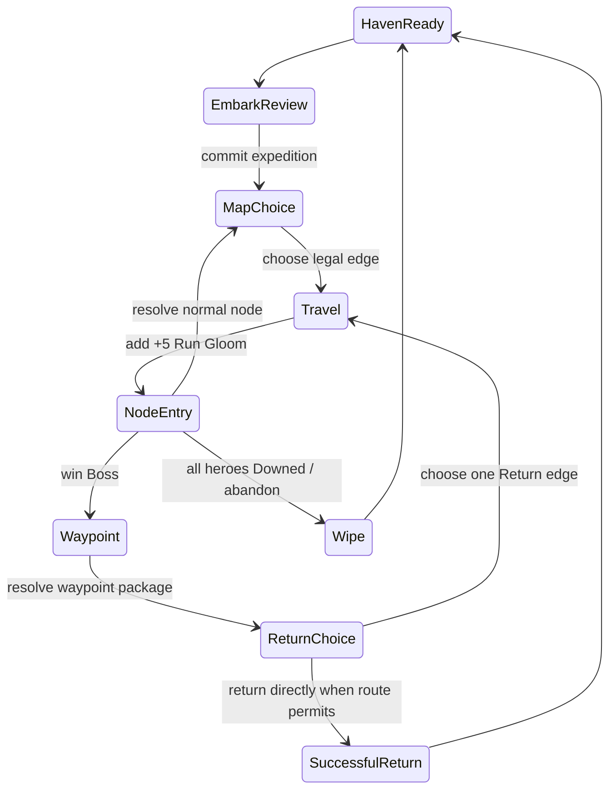

# Expedition State Machine

**Status:** Accepted Build 1 run contract  
**Last updated:** 2026-07-19  
**Related:** [Combat Simulation Contract](combat-simulation-contract.md), [Embark and Loadout](embark-and-loadout.md), [Gloom, Light, and Rest](gloom-and-stress.md), [Vertical-Slice Rewards](../content/expeditions/vertical-slice-rewards.md), [Post-Return Haven Flow](../ux/post-return-flow.md)

## Purpose

This contract defines the only legal lifecycle of a Build 1 expedition. It separates facts that become permanent immediately from possessions that remain at risk until a successful Return. UI screens may group steps for readability, but may not reorder their state changes.

## Run creation and Embark commit

`HavenReady` is the sole state in which the player may freely change Haven holdings and party loadout. Embark confirmation creates one immutable run record:

- allocate a `runId`, seed, content version, and named RNG-stream states;
- snapshot the two selected living heroes and their legal nine-slot loadouts;
- move committed Haven item instances, supplies, and resources to expedition holdings;
- instantiate the authored Unlit Road route from that seed, including fogged content; and
- set `runGloom = havenGloom × 4`, then autosave.

The user may cancel before confirmation without a state change. Once confirmed, only legal preparation moments may alter gear, trade held items, learn scrolls, or craft. Closing the game is never abandonment: the exact run state resumes. Explicit in-world abandonment is a wipe-class resolution.

## Travel and node resolution

At `MapChoice`, the player can choose only an outgoing edge from the current resolved node. Revealed node category and fog-of-war presentation are route data; entering a fogged node cannot reroll it.

Each accepted edge resolves in this fixed order:

1. Move the party to the edge destination.
2. Add exactly `+5` Run Gloom, clamp to 100, and record any next-combat pressure caused by its band.
3. Enter and resolve that node according to its typed contract.
4. Persist the resulting state before accepting another map choice.

Combat victory applies its 50%-of-maximum Mana/Stamina recovery before reward selection. Combat loss immediately enters `Wipe`; no recovery or reward is generated. Event, Rest, Safe Craft, reward, and loadout choices must resolve completely before another edge can be selected.

## Boss, waypoint, and Ember order

Defeating the Lantern-Smother does not automatically return the party to Haven. Its state transitions are atomic and ordered:

1. Mark the Whisperwood waypoint as permanently claimed and record its settlement trace.
2. Grant the first-boss permanent discovery: the Ember Vault blueprint. This never needs to be re-earned.
3. Add the boss construction cache, one Ember Shard, and the selected item from the three revealed boss offers to expedition holdings.
4. At the waypoint, let the player choose whether to spend the carried Ember Shard immediately on a legal remote Pillar rite. A spent Shard repairs one snuffed pillar and remains spent even if the party later wipes.
5. Let the player seal up to three eligible stacks/items in the waypoint chest. A seal is irreversible for this run.
6. Present the route's Return choice: a Return Combat or Return Event. The player may not continue normal Approach/Delve traversal after the waypoint.

Waypoint claim, blueprint, and settlement trace are permanent world facts on boss victory. Physical rewards—including the Shard if not spent and boss gear if not sealed—remain expedition holdings and are lost on a later wipe. This distinction is intentional: reaching the waypoint grows the world, while getting home still matters.

## Successful Return

After the selected Return node resolves, `SuccessfulReturn` applies exactly once in this order:

1. Release this waypoint's chest contents and bank all surviving expedition holdings/resources to Haven.
2. Preserve eligible learned-scroll cards for surviving heroes; reset combat-only and temporary expedition state, including temporary stat points and level.
3. Recover ordinary HP, Mana, and Stamina; retain applicable injuries.
4. Create one pending Leadership Point for each surviving boss-clear hero.
5. Apply Run Gloom's Haven-residual result, then record permanent blueprint/discovery/event facts.
6. Generate deterministic `chronicleFacts`, autosave the completed run, then enter the post-return Haven flow.

The Post-Return Haven Flow owns presentation and the optional immediate Wardyard assignment. It may not reapply any expedition transaction.

## Wipe-class resolution

A wipe is caused only by all heroes being Downed in combat or the player's explicit in-world abandonment confirmation. Resolve it exactly once:

1. Stop the current node immediately; do not grant victory recovery, node rewards, or unresolved choices.
2. Lose the expedition party, their personal learned cards, and all unsealed expedition holdings/resources.
3. Preserve waypoint-chest contents at their current waypoint, still locked until a later successful Return or reclaim expedition.
4. Keep already-committed permanent facts: claimed waypoint, recovered blueprint/discovery, and any Ember Shard already spent on a rite.
5. Snuff one lit Haven pillar; apply the wipe Haven-Gloom outcome; write memorial/failure facts.
6. If this snuffs the final pillar, create the Haven-failure/new-Haven context. Otherwise return to Haven with the wipe results.

No partial hero survival exists in Build 1: any full-party wipe loses the whole committed pair, even if a downed hero had previously been revived or the other hero had been standing earlier in the encounter.

## Required validation and persistence

- A run has one mutually exclusive terminal resolution: successful Return or wipe.
- A route must have a legal Haven-to-Boss-to-Waypoint-to-Return-to-Haven path.
- Only a resolved Boss may enter the Waypoint state; only a resolved Waypoint may expose Return edges.
- An item instance has exactly one location at every revision: Haven, hero equipment, expedition holdings, waypoint chest, consumed, or lost.
- Permanent fact grants are idempotent. Replaying a saved boss/Return boundary cannot duplicate blueprints, construction cache, Leadership Points, or a pillar repair.
- Autosave at Embark, each resolved travel/node boundary, each boss/waypoint decision, and each terminal resolution. Use the revisioned command and named-RNG rules in the Combat Simulation Contract.

## Acceptance criteria

- [ ] A player who clears the boss and wipes on Return keeps the waypoint and Ember Vault blueprint but loses unsealed boss loot and the unspent Shard.
- [ ] A player who spends the Shard at the waypoint and wipes on Return keeps the repaired pillar.
- [ ] A player who seals an eligible item and wipes on Return can recover it later, but cannot use it during that Return leg.
- [ ] Reloading at any listed boundary presents the same legal next choices and never duplicates a permanent grant.
